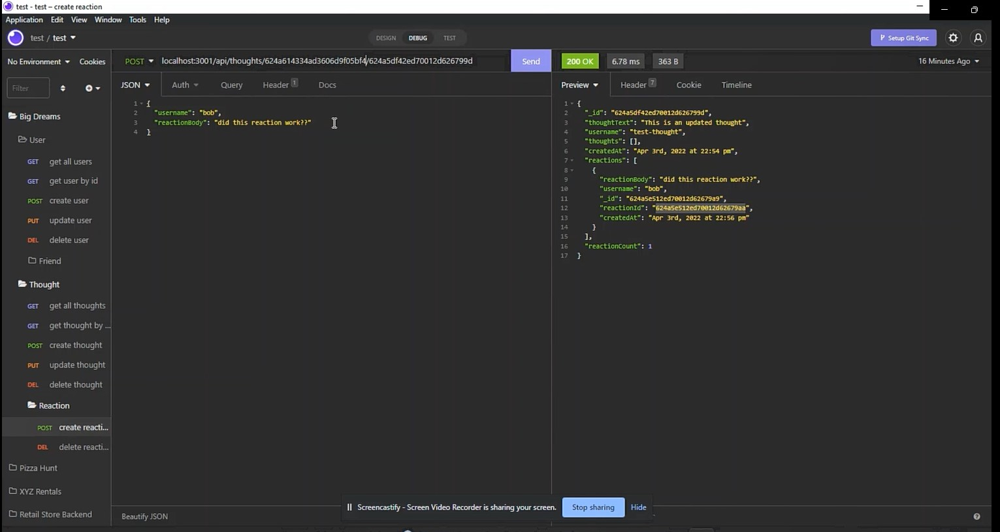

# Big Dreams

## Description

Social network API allowing users to make and remove friends, add thoughts, and reactions to specific thoughts.

## Table of Contents

* [Installation](#installation)
* [Usage](#usage)
* [Contributing](#contributing)
* [Tests](#tests)
* [Questions](#questions)

## Installation

Once downloaded use npm i to download all the neccisary packages

## Usage

Once downloaded you can start the server with express, while the database is left up to mongoose and mongodb.

## Contributing

Standard contribution practices 

## Tests

not at this time

## Questions

If you have an questions feel free to contact me via [Email](dsapione@gmail.com)
and checkout my other projects on [GitHub](https://github.com/dsapione).
